<div align="center">

# 🛡️ FIR Sahayak

### Multi-Lingual FIR Summarization Portal with Local Case Database

**An offline-first, AI-powered e-Police Desk for FIR intake, OCR, summarization, multilingual translation, and natural-language case search.**

[](LICENSE)
[](https://www.python.org/)
[](https://fastapi.tiangolo.com/)
[](https://react.dev/)
[](https://bun.sh/)
[](https://huggingface.co/Qwen/Qwen2.5-1.5B-Instruct)
[](https://github.com/tesseract-ocr/tesseract)
[](https://www.sqlite.org/)

</div>

---

## 📖 Table of Contents

- [Overview](#-overview)
- [Problem Statement](#-problem-statement)
- [Objectives](#-objectives)
- [Key Features](#-key-features)
- [System Architecture](#-system-architecture)
- [System Flowchart](#-system-flowchart)
- [Application Walkthrough](#-application-walkthrough)
- [Technology Stack](#-technology-stack)
- [Frontend — React + Bun + Vite](#-frontend--react--bun--vite)
- [Backend — FastAPI + SQLite](#-backend--fastapi--sqlite)
- [Model Fine-Tuning — Qwen2.5-1.5B-Instruct (QLoRA)](#-model-fine-tuning--qwen2515b-instruct-qlora)
- [End-to-End Pipeline](#-end-to-end-pipeline)
- [Installation & Setup](#-installation--setup)
- [Project Structure](#-project-structure)
- [Contributors](#-contributors)
- [Acknowledgements](#-acknowledgements)
- [License](#-license)

---

## 🚀 Overview

**FIR Sahayak** is an AI-powered, offline-ready **e-Police Desk** built to modernize First Information Report (FIR) management for Indian law enforcement. It transforms unstructured FIR documents — scanned PDFs, phone photos, handwritten notes — into structured, searchable, multilingual case records.

The system performs five core tasks end-to-end:

1. **Extracts text** from uploaded FIR documents using **Tesseract OCR**.
2. **Summarizes** the raw narrative into a structured, police-ready summary using a **fine-tuned Qwen2.5-1.5B-Instruct** model.
3. **Translates** the summary into **12 Indian languages**.
4. **Stores** everything in a **local SQLite database**.
5. **Enables conversational search** over the case database using a natural language query parser powered by **regex, date NLP, and feature extraction**.

No cloud. No third-party APIs. No data leakage. Fully functional in air-gapped environments.

---

## 🎯 Problem Statement

Indian police stations handle thousands of FIRs manually every year. These documents are:

- **Written in mixed languages** (English, Hindi, Bengali, regional scripts).
- **Physically archived** as scanned PDFs or photographs.
- **Not searchable** — locating a case requires reading physical registers.
- **Inconsistent in format** — dates appear as `DD/MM/YYYY`, `YYYY-MM-DD`, `13 June 2025`, or even `"Not explicitly stated"`.
- **Not accessible to non-native speakers** — a Bengali FIR cannot be quickly read by a Tamil-speaking officer, and vice versa.

Existing digital tools are either **cloud-dependent** (violating data sovereignty), **English-only**, or **limited to manual data entry** — offering no OCR, no summarization, no multilingual support, and no natural-language retrieval.

### 💡 Our Solution

**FIR Sahayak** solves this by building a **fully offline, AI-native FIR management system** that:

- Accepts any FIR document format and extracts text via OCR.
- Uses a **locally fine-tuned LLM** to generate structured summaries.
- Translates summaries across 12 Indian languages.
- Stores all records locally in SQLite.
- Allows officers to **chat** with the case database using natural language.

---

## 🧭 Objectives

| # | Objective | Status |
|---|-----------|--------|
| 1 | Build a fully offline FIR ingestion pipeline using Tesseract OCR | ✅ |
| 2 | Fine-tune Qwen2.5-1.5B-Instruct for police-grade FIR summarization | ✅ |
| 3 | Support 12 Indian languages for translation of FIR summaries | ✅ |
| 4 | Provide a modern, responsive React + Bun frontend | ✅ |
| 5 | Enable natural language search with robust date parsing | ✅ |
| 6 | Store all data locally — zero third-party API dependency | ✅ |
| 7 | Deploy as a Docker-ready, air-gapped compatible system | ✅ |

---

## ✨ Key Features

| Feature | Description |
|---------|-------------|
| 📄 **FIR Upload & OCR** | Upload PDF / PNG / JPG FIR documents — text is extracted automatically using Tesseract OCR (English, Hindi, Bengali language packs). |
| 🧠 **AI Summarization** | A fine-tuned **Qwen2.5-1.5B-Instruct** model produces structured summaries with FIR number, police station, district, incident date/time, complainant, accused, legal sections, and narrative. |
| 🌐 **12-Language Translation** | Summaries instantly translatable into **Bengali, Hindi, Telugu, Tamil, Odia, Marathi, Gujarati, Kannada, Malayalam, Punjabi, Urdu, and Sanskrit**. |
| 🔎 **Conversational Search** | Query the database in plain English — *"show FIRs between 1 Jan 2025 and 15 June 2025"* or *"search complainant Amit"*. |
| 📋 **Advanced Filtering** | Filter by FIR number, complainant/accused name, date range, police station, district, and legal sections. |
| 🗄️ **Local SQLite Database** | All case data stored locally — no cloud, no external DB server. |
| 💻 **React + Bun Frontend** | Fast, modern SPA built with React, Vite, and served via Bun runtime. |
| 🔒 **Offline-First** | Fully functional without internet — ideal for secure law-enforcement environments. |

---

## 🏗️ System Architecture

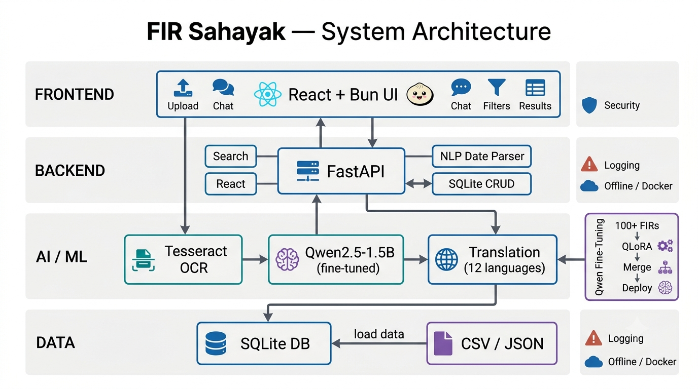

The architecture is organized into **four horizontal layers**, with a dedicated **Qwen fine-tuning pipeline** feeding into the AI/ML layer:

### 1. Data Layer
- **SQLite database** (`fir_metadata.db`) — schema: `id, fir_number, police_station, district, fir_date, incident_date, legal_sections, complainant, accused, summary, ocr_text, translated_summaries`
- **CSV / JSON ingestion** for bulk FIR records
- **Data cleaning utilities** — `pd.to_datetime(errors='coerce')`, normalization of `"Not explicitly stated"` → `NaT`

### 2. AI / ML Layer
- **Tesseract OCR** — extracts raw text from FIR documents (local binary in `backend/tesseract_ocr/`)
- **Qwen2.5-1.5B-Instruct (fine-tuned)** — generates structured summaries
- **Translation module** — 12 Indian languages (primary: `deep_translator`, offline fallback: IndicTrans2)

### 3. Application Logic Layer (FastAPI)
- `services/search.py` — advanced search engine
- `normalise_date()` — robust multi-format date parsing
- `init_db()` / `save_fir_record()` — CRUD operations
- `parse_natural_query()` — NLP query parser (regex + date logic + feature extraction)
- REST endpoints: `/upload`, `/summarize`, `/translate`, `/search`, `/filter`, `/chat`

### 4. Presentation Layer (React + Bun)
- Chat assistant
- Advanced filters sidebar
- Case results table
- Document upload panel
- Debug filter output

---

## 🔄 System Flowchart

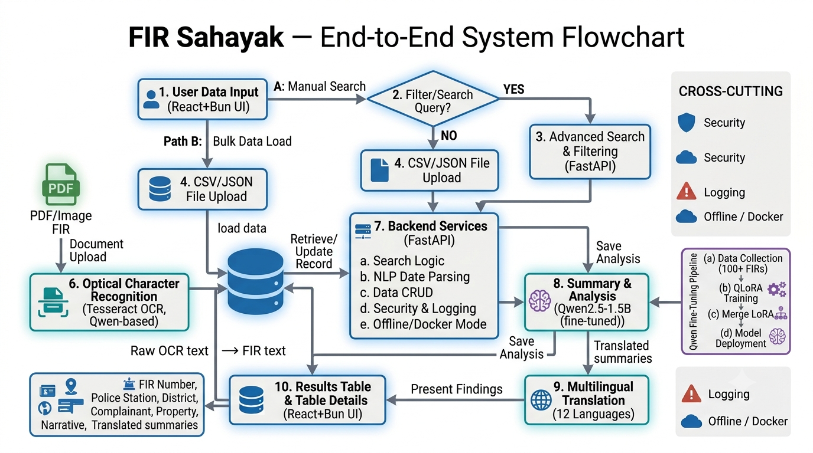

The end-to-end flow:

```
Upload FIR → OCR (Tesseract) → Raw Text
    → Qwen Summarizer (fine-tuned) → Structured Summary
    → Translation (12 languages)
    → SQLite Storage
    → React Frontend (display / search / chat)
```

---

## 🖼️ Application Walkthrough

### 🏠 Homepage — Landing & Overview

The homepage introduces the FIR Sahayak portal with a police-themed dark UI, clear navigation, and an overview of capabilities.


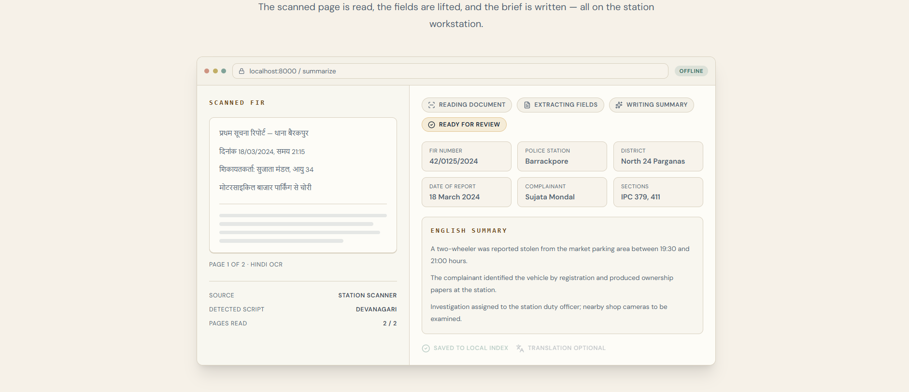
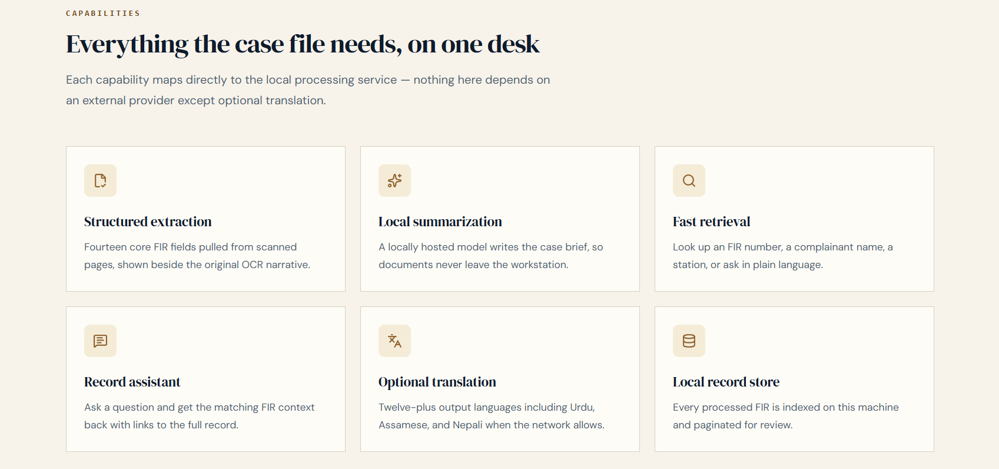
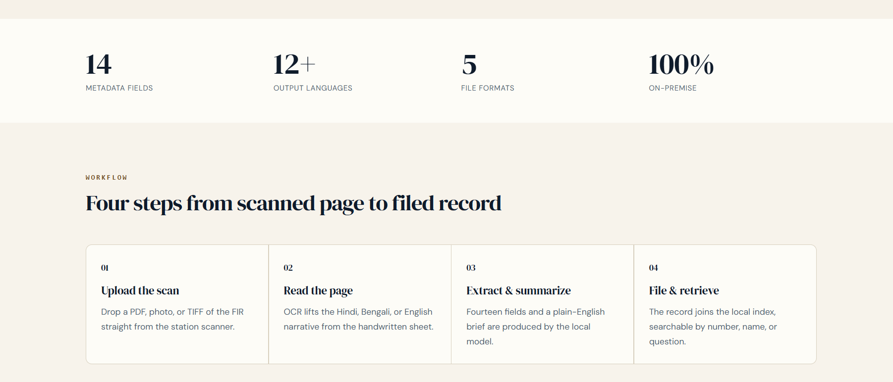

The landing experience is designed for rapid onboarding — an officer can immediately see what the system does (OCR, summarize, translate, search) and jump straight into the relevant module.

---

### 📊 Investigation Dashboard

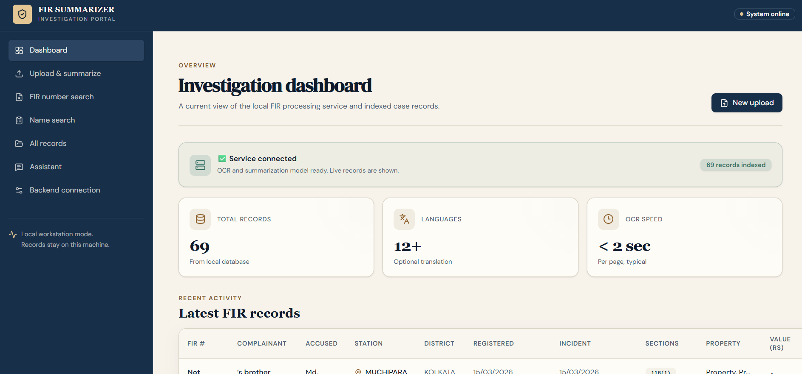

A centralized dashboard showing case counts, recent FIRs, and quick-access entry points to each module (Upload, Search, Chat Assistant). Acts as the officer's daily working surface.

---

### 📄 Upload & Summarize — End-to-End Pipeline

The core AI pipeline. An officer uploads a scanned FIR document (PDF/PNG/JPG); the system performs OCR, summarization, and translation.

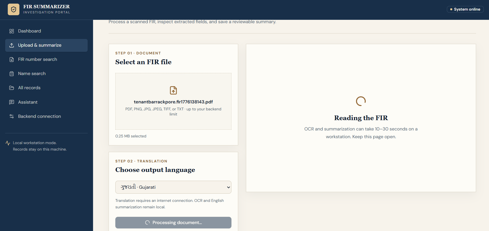
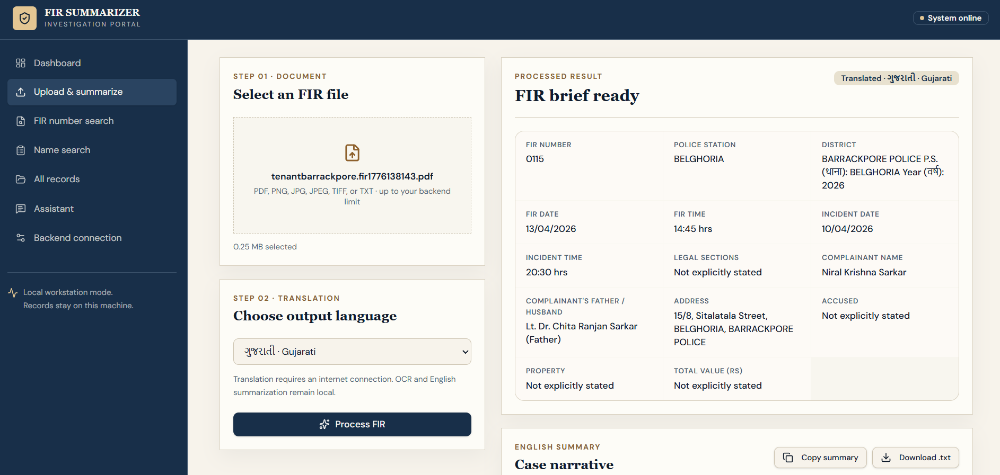
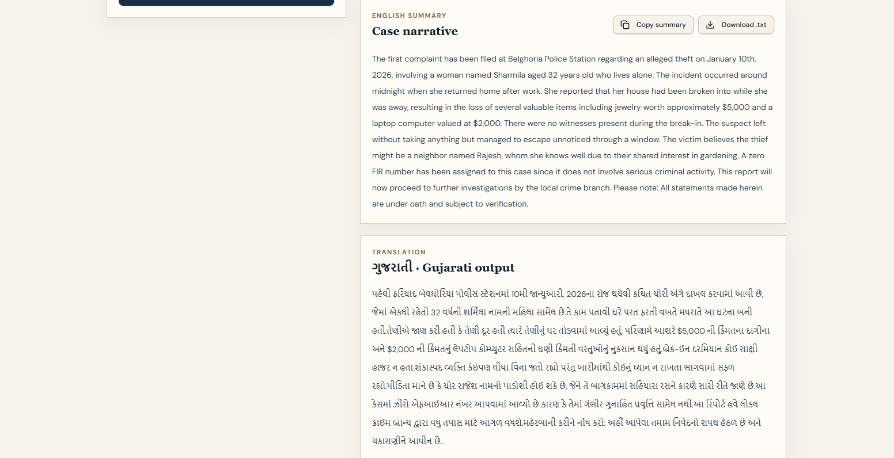

**Step-by-step pipeline:**

1. **Upload** — FIR document is uploaded via the React UI.
2. **Tesseract OCR** — Raw text is extracted (English + Hindi + Bengali support).
3. **Qwen Summarization** — The fine-tuned **Qwen2.5-1.5B-Instruct** model produces a structured summary containing:
   - FIR Number
   - Police Station
   - District
   - Incident Date & Time
   - Complainant Name
   - Accused Name(s)
   - Legal Sections
   - Property Involved
   - Concise Narrative
4. **Translation** — The summary is translated on-demand into any of the **12 supported Indian languages**:
   - Bengali (বাংলা), Hindi (हिन्दी), Telugu (తెలుగు), Tamil (தமிழ்), Odia (ଓଡ଼ିଆ), Marathi (मराठी), Gujarati (ગુજરાતી), Kannada (ಕನ್ನಡ), Malayalam (മലയാളം), Punjabi (ਪੰਜਾਬੀ), Urdu (اردو), Sanskrit (संस्कृतम्)
5. **Storage** — All extracted fields, summaries, and translations are saved to SQLite.

---

### 🔢 Search FIR by Number

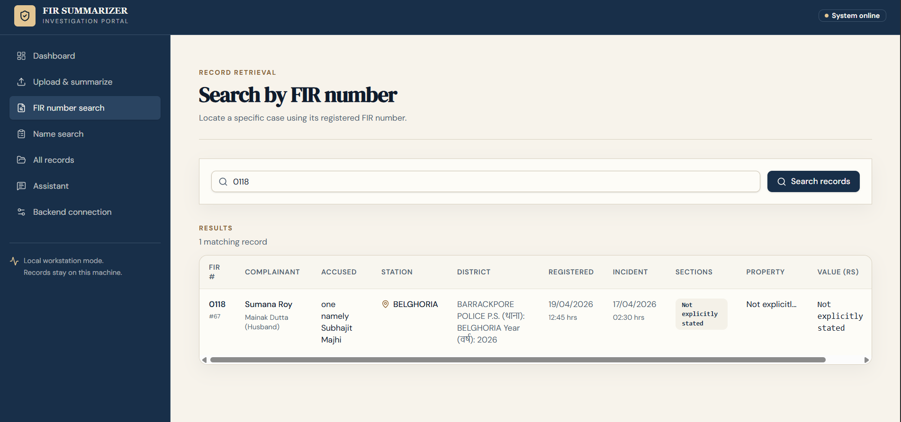
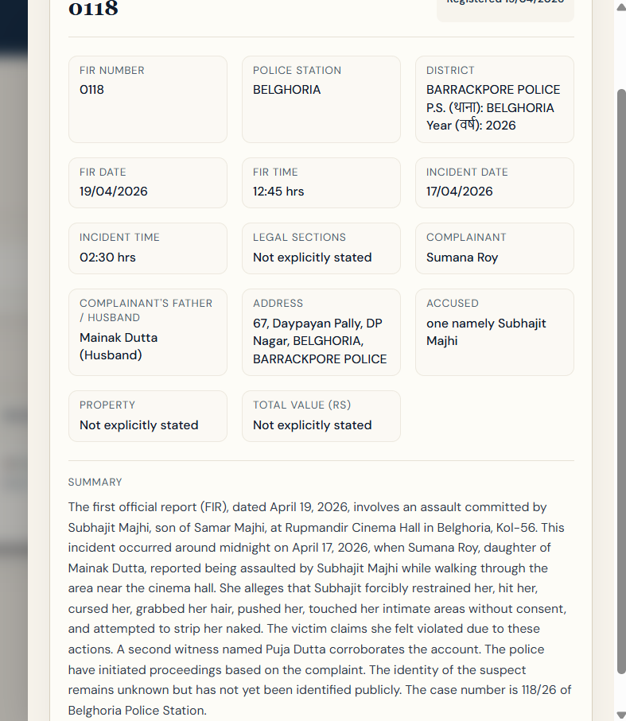

Instant lookup using the official FIR number. Officers type the FIR number and receive the full record — summary, complainant, accused, legal sections, and translations.

---

### 👤 Search FIR by Name

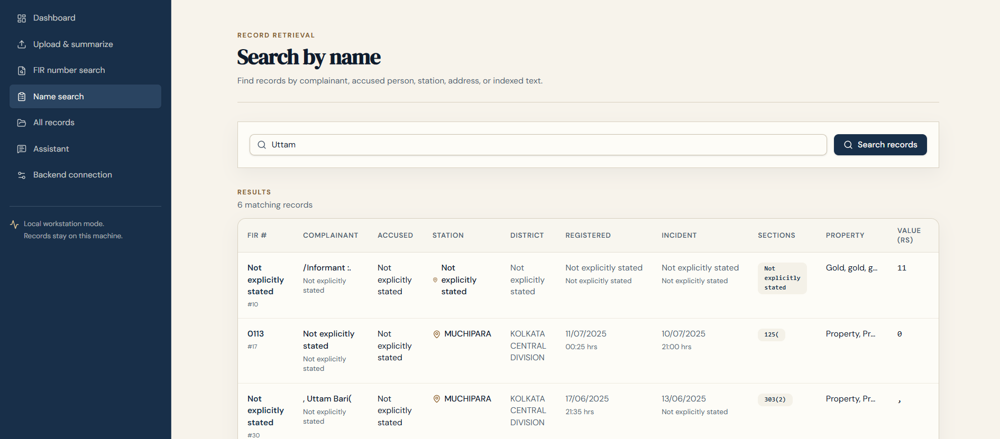

Find cases by **complainant** or **accused name**. Partial matching is supported — typing `Amit` returns all FIRs where "Amit" appears as complainant or accused.

---

### 📚 View All FIR Records

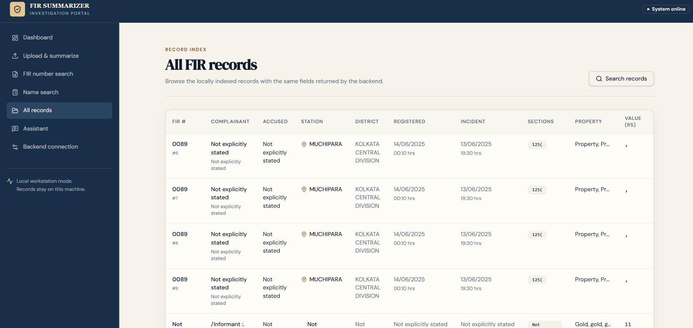

A complete case register. Every FIR is displayed with its metadata and **summaries readable instantly** — no need to open individual documents.

---

### 💬 Conversational Chat Assistant — NLP Search

The most powerful interface. Officers interact with the case database using **natural language**, powered by NLP techniques, advanced search, feature extraction, and regex.

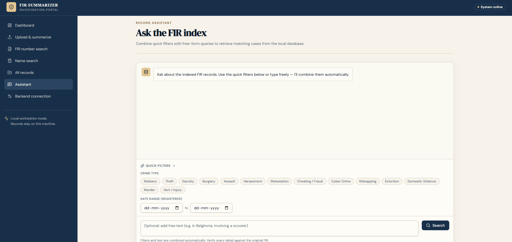
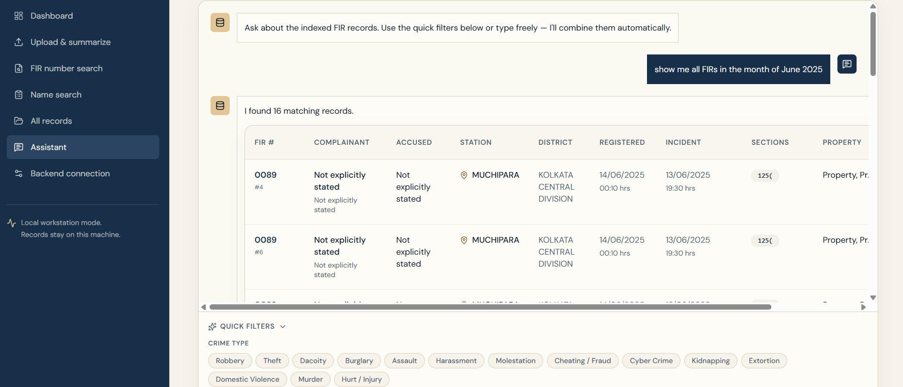
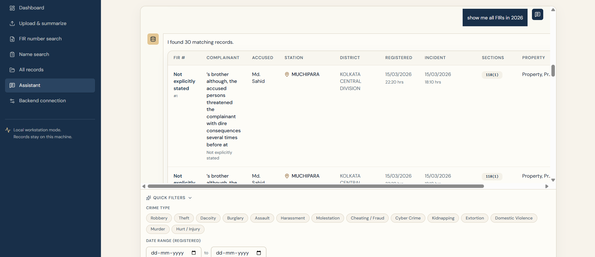
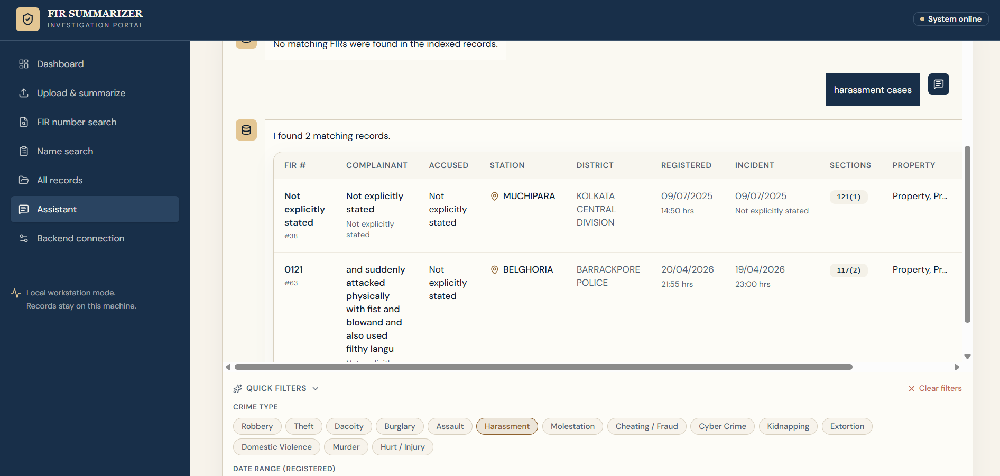
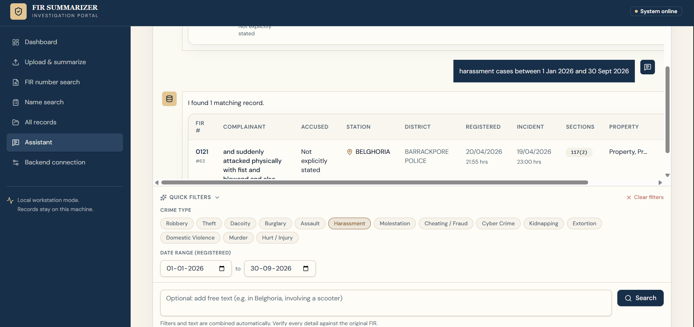

**What the chat assistant understands:**

- **Date ranges** — *"show FIRs between 1 Jan 2025 and 15 June 2025"*
- **Month + year** — *"show all FIRs in June 2025"*
- **Case type** — *"theft cases in Bidhannagar"*
- **Names** — *"search complainant Amit"*
- **FIR numbers** — *"show FIR 0456"*
- **Free-text** — *"cases involving mobile phone theft"*

**How it works under the hood:**

1. **Regex-based explicit date-range extraction** — patterns like `between X and Y`, `from X to Y`.
2. **Fallback month/year detection** — `June 2025` → `2025-06-01` to `2025-06-30`.
3. **Default-year logic** — `June` alone defaults to the **data year (2025)**, not the current year.
4. **Feature extraction** — pulls out names, case types, legal sections, districts.
5. **Structured filter output** — `{start_date, end_date, date_field: 'incident_date', text_filters...}`
6. **SQL filtering** — parameterized LIKE queries on SQLite.

> ⚠️ **Note on data quality:** When a date filter is active, FIR records with unparseable dates (e.g., `"Not explicitly stated"`) are **excluded by default** — this is a deliberate design decision to avoid false positives.

---

## 🛠️ Technology Stack

| Layer | Technology |
|-------|------------|
| **Frontend** | React (TypeScript), Vite, TanStack Router, Bun (runtime + package manager) |
| **Backend** | FastAPI (Python 3.9+) |
| **OCR** | Tesseract OCR (English, Hindi, Bengali language packs) |
| **Summarization** | Qwen2.5-1.5B-Instruct (fine-tuned via QLoRA) |
| **Translation** | `deep_translator` + IndicTrans2 (offline fallback) |
| **Database** | SQLite3 |
| **Date Parsing** | `dateparser` + custom regex NLP |
| **Training Platform** | AIKosh (GPU infrastructure) |
| **Deployment** | Docker-ready, fully offline capable |

---

## 💻 Frontend — React + Bun + Vite

The frontend is a modern **React SPA** built with **Vite** and served using **Bun** for maximum speed.

**Key characteristics:**

- **Bun** as package manager and runtime (`bun.lock`, `bunfig.toml`).
- **Vite** as the build tool (`vite.config.ts`).
- **TypeScript** for type-safe API contracts with the FastAPI backend.
- **TanStack Router** for routing (`router.tsx`, `routeTree.gen.ts`).
- **Component-driven architecture** — modular pages for Upload, Search, Chat, Dashboard.
- **Dark police-themed UI** — optimized for low-light station environments.

**Main modules (inside `frontend/src/`):**

| Module | Purpose |
|--------|---------|
| `routes/` | Page components (Upload, Search, Chat, Dashboard) |
| `components/` | Reusable UI components |
| `hooks/` | Custom React hooks for API calls and state |
| `lib/` | Utility functions and API client |
| `server.ts` | Frontend server configuration |
| `start.ts` | App entry point |

**Run the frontend:**

```bash
cd frontend
bun install
bun run dev
```

---

## ⚙️ Backend — FastAPI + SQLite

The backend exposes a clean REST API consumed by the React frontend.

**Core modules (inside `backend/app/`):**

```
backend/
├── app/
│   ├── services/
│   │   ├── ocr.py            # Tesseract OCR wrapper
│   │   ├── search.py         # Advanced search + filters
│   │   ├── summarizer.py     # Qwen inference wrapper
│   │   └── translator.py     # 12-language translation
│   ├── utils/                # Helper functions
│   ├── main.py               # FastAPI app entrypoint
│   └── models.py             # Pydantic/database models
├── fir_metadata.db           # Local SQLite database
├── download_langs.py         # Tesseract language pack downloader
├── test_ocr.py               # OCR testing utility
├── view_db.py                # Database viewer utility
├── requirements.txt
├── Dockerfile
└── .env
```

**Key functions:**

- `search_by_fir_number(fir_no)` — exact FIR lookup
- `search_by_name(name)` — partial match on complainant/accused
- `advanced_search(filters)` — multi-filter query builder
- `normalise_date(str)` — supports 5+ formats; returns `None` for invalid
- `parse_natural_query(text)` — NLP → structured filter dict
- `init_db()` / `save_fir_record()` — schema auto-creation + inserts

**Run the backend:**

```bash
cd backend
python -m venv venv
source venv/bin/activate    # Windows: venv\Scripts\activate
pip install -r requirements.txt
uvicorn app.main:app --reload
```

---

## 🧠 Model Fine-Tuning — Qwen2.5-1.5B-Instruct (QLoRA)

This is the **heart of FIR Sahayak**. The summarization quality depends entirely on how well Qwen was adapted to Indian FIR language.

### Base Model

**`Qwen/Qwen2.5-1.5B-Instruct`** — a 1.5-billion-parameter decoder-only transformer from Alibaba's Qwen family. Chosen for:

- **Small size** — runs on modest hardware, fits offline deployment constraints.
- **Strong instruction-following** — already capable of structured output before fine-tuning.
- **Multilingual pretraining** — handles Hindi, Bengali, and code-mixed text.

### Fine-Tuning Method — QLoRA

We used **QLoRA (Quantized Low-Rank Adaptation)** to fine-tune the model on **100+ real Indian FIR documents** without needing enterprise-grade GPUs.

**Why QLoRA?**
- Base model loaded in **4-bit** (bitsandbytes NF4 quantization) → huge memory savings.
- Only **LoRA adapters** are trained → tiny trainable parameter count.
- Full fine-tuning of a 1.5B model would require ~24 GB VRAM; QLoRA fits on a single **T4 (16 GB)** GPU.

### Training Configuration

```yaml
base_model: Qwen/Qwen2.5-1.5B-Instruct
method: QLoRA
quantization: 4-bit (nf4, double-quant)
lora_r: 16
lora_alpha: 32
lora_dropout: 0.05
target_modules: [q_proj, k_proj, v_proj, o_proj]
learning_rate: 2.0e-4
lr_scheduler: cosine
num_train_epochs: 3
per_device_train_batch_size: 4
gradient_accumulation_steps: 4
max_seq_length: 2048
neftune_noise_alpha: 5
bf16: true
```

### Training Pipeline

```
┌────────────────────────────────────────────────────────────┐
│  STAGE 1 — DATA COLLECTION                                 │
│  • 100+ raw FIR documents (PDF / PNG / JPG)                │
│  • OCR extraction via Tesseract                            │
│  • Manual verification of key fields                       │
└────────────────────────────────────────────────────────────┘
                          ↓
┌────────────────────────────────────────────────────────────┐
│  STAGE 2 — INSTRUCTION FORMATTING                          │
│  • Convert (FIR text, structured summary) pairs            │
│  • Wrap in Qwen chat template:                             │
│    <|im_start|>system                                      │
│    You are an FIR summarization assistant...               │
│    <|im_end|>                                              │
│    <|im_start|>user                                        │
│    FIR TEXT: [raw OCR]                                     │
│    <|im_end|>                                              │
│    <|im_start|>assistant                                   │
│    {structured JSON summary}                               │
│    <|im_end|>                                              │
└────────────────────────────────────────────────────────────┘
                          ↓
┌────────────────────────────────────────────────────────────┐
│  STAGE 3 — TRAIN / VAL SPLIT (80/20)                       │
│  • Stratified by FIR type, language, length                │
└────────────────────────────────────────────────────────────┘
                          ↓
┌────────────────────────────────────────────────────────────┐
│  STAGE 4 — QLoRA TRAINING ON AIKOSH GPU                    │
│  • 4-bit base + LoRA adapters                              │
│  • SFTTrainer (HuggingFace TRL)                            │
│  • NEFTune noise injection for generalization              │
│  • ~2-4 hours on a single T4                               │
└────────────────────────────────────────────────────────────┘
                          ↓
┌────────────────────────────────────────────────────────────┐
│  STAGE 5 — EVALUATION & MERGING                            │
│  • ROUGE-L, BERTScore, field extraction accuracy           │
│  • Human review of sample summaries                        │
│  • Merge LoRA adapter into base model                      │
└────────────────────────────────────────────────────────────┘
                          ↓
┌────────────────────────────────────────────────────────────┐
│  STAGE 6 — DEPLOYMENT                                      │
│  • Save merged model to local disk                         │
│  • Load in FastAPI backend at startup                      │
│  • Fallback: if summary < 50 chars → return raw narrative  │
└────────────────────────────────────────────────────────────┘
```

### System Prompt Used for Training

```
You are an FIR summarization assistant for Indian law enforcement.
Extract all key facts from the provided FIR text and return a
structured summary in JSON format. Include: FIR number, police
station, district, incident date/time, complainant name, accused
name(s), legal sections, property involved, and a concise narrative.
If any field is missing, set it to null. Do not add information
not present in the text.
```

### Inference & Fallback

```python
def summarize(fir_text: str) -> str:
    prompt = build_fir_prompt(fir_text)
    outputs = model.generate(**tokenizer(prompt, return_tensors="pt"),
                             max_new_tokens=512, temperature=0.3)
    summary = tokenizer.decode(outputs[0][input_len:], skip_special_tokens=True)

    # Safety fallback: short summary = model uncertainty → return raw text
    if len(summary.strip()) < 50:
        return fir_text
    return summary
```

### Training Platform — AIKosh

All fine-tuning was performed on **AIKosh** — India's national AI compute platform — using GPU infrastructure provided through the platform. This enabled QLoRA training of the 1.5B model without requiring local high-end GPUs, and kept the entire training pipeline within Indian sovereign infrastructure.

### Evaluation Metrics

| Metric | What it measures | Target |
|--------|-----------------|--------|
| ROUGE-L | Overlap with reference summaries | >= 0.82 |
| BERTScore | Semantic similarity | > 0.88 |
| Field extraction accuracy | Structured field correctness | > 85% |
| Date accuracy | Incident date normalization | > 90% |
| Hallucination rate | Info not present in source | < 5% |

---

## 🔁 End-to-End Pipeline

```
        ┌──────────────────┐
        │  Officer uploads │
        │   FIR document   │
        └────────┬─────────┘
                 ↓
        ┌──────────────────┐
        │  Tesseract OCR   │  ← English / 12 Indian Languages
        │  (text extract)  │
        └────────┬─────────┘
                 ↓
        ┌──────────────────┐
        │  Qwen2.5-1.5B    │  ← fine-tuned via QLoRA on AIKosh
        │  (summarization) │
        └────────┬─────────┘
                 ↓
        ┌──────────────────┐
        │  Translation     │  ← 12 Indian languages
        │  (multilingual)  │
        └────────┬─────────┘
                 ↓
        ┌──────────────────┐
        │  SQLite DB       │  ← local storage, no cloud
        └────────┬─────────┘
                 ↓
        ┌──────────────────┐
        │  React + Bun UI  │  ← search, chat, filters
        │  (display layer) │
        └──────────────────┘
```

---

## 🛠️ Installation & Setup

### Prerequisites

- **Python 3.9+**
- **Bun** ([install](https://bun.sh/)) — for the React frontend
- **Tesseract OCR** ([download](https://github.com/UB-Mannheim/tesseract/wiki))
- **Poppler** (for PDF → image conversion) ([download](https://github.com/oschwartz10612/poppler-windows/releases/))

### 1. Clone the Repository

```bash
git clone https://github.com/Saptakcodes/FIR-SAHAYAK-Multi-Lingual-FIR-Summarization-Portal-with-Local-Case-Database-Using-ReactUI.git
cd FIR-SAHAYAK-Multi-Lingual-FIR-Summarization-Portal-with-Local-Case-Database-Using-ReactUI
```

### 2. Backend Setup

```bash
cd backend
python -m venv venv
source venv/bin/activate    # Windows: venv\Scripts\activate
pip install -r requirements.txt
uvicorn app.main:app --reload
```

### 3. Frontend Setup

```bash
cd frontend
bun install
bun run dev
```

### 4. Model Setup

Download the fine-tuned Qwen model (or place your locally merged model + LoRA adapter in `backend/models/`). The backend loads it automatically at startup.

### 5. Open the App

Navigate to the URL printed by Vite (typically `http://localhost:5173`).

---

## 📁 Project Structure

```
FIR-SAHAYAK/
├── frontend/                    # React + Vite + Bun SPA
│   ├── public/                  # Static assets + screenshots
│   │   ├── fir-rc-1.png ... fir-rc-19.png
│   ├── src/
│   │   ├── components/          # Reusable UI components
│   │   ├── hooks/               # Custom React hooks
│   │   ├── lib/                 # Utilities and API client
│   │   ├── routes/              # Page components (TanStack Router)
│   │   ├── router.tsx
│   │   ├── routeTree.gen.ts
│   │   ├── server.ts
│   │   ├── start.ts
│   │   └── styles.css
│   ├── package.json
│   ├── bun.lock
│   ├── vite.config.ts
│   └── tsconfig.json
├── backend/                     # FastAPI + Qwen inference
│   ├── app/
│   │   ├── services/
│   │   │   ├── ocr.py
│   │   │   ├── search.py
│   │   │   ├── summarizer.py
│   │   │   └── translator.py
│   │   ├── utils/
│   │   ├── main.py
│   │   └── models.py
│   ├── models/                  # Fine-tuned Qwen + LoRA adapter
│   ├── tesseract_ocr/           # Local Tesseract binaries
│   ├── poppler/                 # Local Poppler binaries
│   ├── fir_metadata.db
│   ├── Dockerfile
│   ├── requirements.txt
│   └── .env
├── LICENSE
└── README.md
```

---

## 👥 Contributors

- **Saptak Chaki** — [@Saptakcodes](https://github.com/Saptakcodes)
- **Debdutta Ghosh**

---

## 🙏 Acknowledgements

- This project was developed during an internship at **AnalyzeHive Global LLP**.
- Model fine-tuning was performed on the **AIKosh** platform using its GPU infrastructure.
- Base model: **Qwen2.5-1.5B-Instruct** by Alibaba Cloud.
- OCR powered by **Tesseract**.
- Frontend built with **React**, **Vite**, and **Bun**.

---

## 📜 License

This project is licensed under the **MIT License** — see the [LICENSE](LICENSE) file for details.

---

<div align="center">

**FIR Sahayak** — *Fast, accurate, offline AI for law enforcement.*

Made with 🛡️ in India.

</div>
